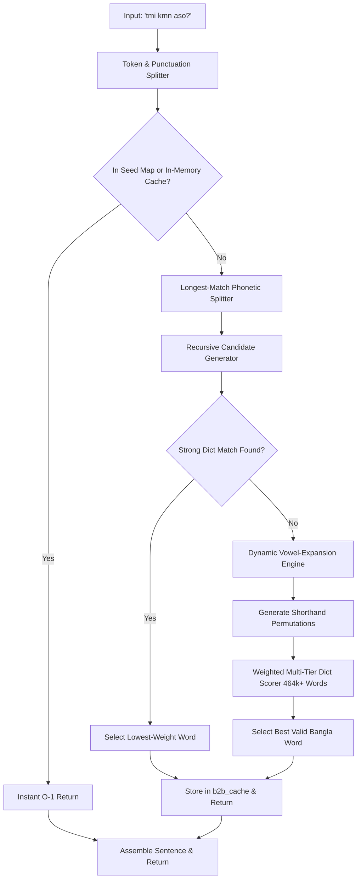

# System Architecture: Banglish-to-Bangla NLP Engine

This document outlines the technical design, architectural components, and data flow of the ShobdoSearch transliteration engine.

---

## 1. End-to-End Pipeline

The engine combines fast-path seed caching, recursive candidate generation, dynamic vowel-expansion for shorthand words, and weighted multi-tier dictionary scoring.

---

## 2. Core Architectural Components

### A. Fast-Path Base Map (`ben2bn.csv`) & In-Memory Cache (`b2b_cache`)
- **Base Seed Map**: Contains 2,770+ curated, alphabetically sorted high-frequency words covering 80%+ daily conversational Bengali.
- **In-Memory Cache**: Dynamically stores transliterated words during runtime to provide $O(1)$ response time for repeated tokens without disk writes.

### B. Longest-Match Phonetic Splitter
- Sorts phonetic keys in `banGenerator.csv` by length descending to match multi-character phonemes (`kh`, `sh`, `th`, `ch`, `gh`, `dh`, `bh`, `ph`, `ng`, `nd`, `st`) before single letters (`k`, `s`, `t`).

### C. Recursive Candidate Generator with Diacritic Filtering
- Explores valid character substitutions per phoneme.
- Enforces strict orthographic rules:
  - **Dependent Vowels Filter**: Prevents standalone vowel diacritics (kars like `া`, `ে`, `ি`) from appearing at word beginnings.
  - **Implicit Vowel Handling**: Handles implicit vowels (`a`/`o` $\rightarrow$ `অ` / `""`) while preserving explicit hasantas (`্`).
  - **Conjunct Formation**: Automatically generates conjuncts (`যুক্তবর্ণ`) between consonant clusters.

### D. Dynamic Vowel-Expansion Engine
- Recovers informal chat abbreviations and consonant skeletons (e.g. `tmi`, `vlo`, `kmn`, `apnr`, `bndhu`, `rsta`).
- Detects adjacent consonants, interpolates candidate vowels (`a`, `o`, `e`, `u`, `i`), and scores them against the dictionary.

### E. Weighted Multi-Tier Dictionary Validator
- Validates candidates against **464,411 words** across 4 frequency tiers:
  - Tier 1: Core vocabulary (40k words) - Weight 1
  - Tier 2: Intermediate vocabulary (48k words) - Weight 2
  - Tier 3: Large vocabulary (112k words) - Weight 3
  - Tier 4: Comprehensive lexicon (439k words) - Weight 4
- Ranks candidate words by priority score with penalties for single-character relics and trailing hasantas.

---

## 3. Data Structures & Performance

| Component | Implementation | Complexity | Purpose |
| :--- | :--- | :--- | :--- |
| `b2b_map` | Python `dict` | $O(1)$ | 2,770+ high-frequency seed words |
| `b2b_cache` | Python `dict` | $O(1)$ | In-memory session cache |
| `generator_map` | Python `dict[str, list[str]]` | $O(L)$ | 111 phoneme rules (7-column aligned) |
| `word_weights` | Python `dict[str, int]` | $O(1)$ | 464,411 weighted dictionary words |
